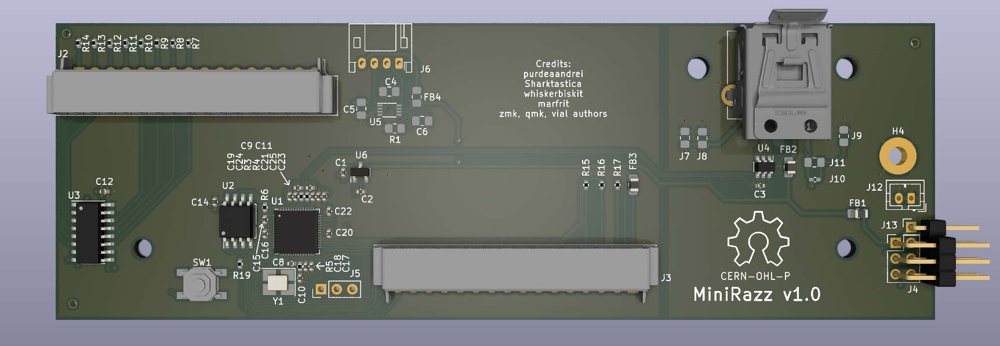
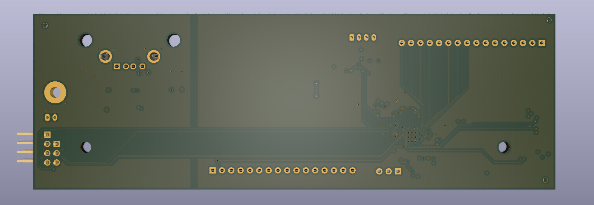

# MiniRazz - open hardware controller replacement for the Mini M keyboard.

This is a replacement keyboard controller, for the Unicomp Mini M
keyboard, this is an independent community project that is not endorsed by
Unicomp, and it is not related to any official controller sold by them.

Licensed under CERN-OHL-P v2 or later

## Images

## How to order from JLCPCB:
1. Go to http://jlcpcb.com , sign in to your account (create one if you don't have one)
2. Click Order Now, click Add gerber file
3. Upload the .zip file from the "order" subfolder.
4. Wait for the gerbers to be processed.
5. Check that it correctly detected 4-layerboard.
6. Select PCB Qty you wish to build
7. Specify Layer Sequence, click Yes, And select L1=F_Cu L2=In1_Cu L3=In2_Cu L4=B_Cu
8. Set "Remove Order Number" to "Specify a location"
9. Scroll down, turn on the "SMT Assembly" option, turn it on
10. Select "PCBA Type" = "Economic"
11. Select "Assembly Side" = "Top Side"
12. Select "Tooling holes" = "Added by Customer"
13. Click "I agree to the Terms and Conditions..."
14. Click "Next" on the right side
15. Click "Next" on the right side
16. Click "Add BOM File", upload the "*_bom_jlc.csv" file from the "order" subfolder.
17. Click "Add CPL File", upload the "*_cpl_jlc.csv" file from the "order" subfolder.
18. Click "Process BPM & CPL"
19. Take a look at what parts are available. At the time of writing J2/J3 triomate connectors were only available if pre-ordered (at a higher cost than ordering from DigiKey).
    You may be able to optimize cost by choosing to solder certain parts yourself, through-hole parts being the most likely candidate. (Please see the following section)
20. Click "Next", you will also have to click "Do Not Place" if some components are missing.
21. Check the rotation of components. JLCPCB may change default rotation in their component libraries at any time, and also position and rotation of the triomates has not been verified.
    - Check that component pins line up correctly with pads
    - Check that components which have polarity (usually marked with a dot) are oriented towards an assimetric marking on the silkscreen (for example for the memory and the io expander there's an extra line, while for the RP2040 there's a missing corner line to mark pin 1)
22. Click "Next"
23. Select Product Description: Office Appliance.../Keyboard...
24. Save to Cart, Check Out.

Cost analysis at the time of writing (2024 Aug 11):

| Qty | JLCPCB (USD) | JLC shipping est. (USD) | Digikey Triomates (USD) | Digikey shipping est. (USD) | VAT (19%) USD | Total USD | Coast per Board |
|-----|--------------|-------------------------|-------------------------|-----------------------------|---------------|-----------|-----------------|
| 5   |   84.34      | 23.80                   | 14.66                   | 30                          | 29.032        | 181.832   | 36.3664         |
| 10  |  106.13      | 29.80                   | 29.32                   | 30                          | 37.0975       | 232.3475  | 23.23475        |
| 15  |  130.10      | 55.54                   | 43.764                  | 30                          | 49.28676      | 308.69076 | 20.579384       |
| 20  |  154.18      | 57.74                   | 58.352                  | 30                          | 57.05168      | 357.32368 | 17.866184       |

## Components of this design that may have to be ordered separately:
- 2 pcs of 16-pin 90-degree triomate connectors / board:
   - Part number: `6-520314-6` (TE Connectivity AMP Connectors)
   - [Digikey](https://www.digikey.com/en/products/detail/te-connectivity-amp-connectors/6-520314-6/1153749)
   - If the 90-degree connectors are not in stock, then you may also be able to get away with vertical ones (part number `6-520315-6`)
      - This has not yet been tested for fit in the keyboard.
   - JLCPCB now has it in its library, however it's not in stock.
     - You can pre-order it, and then have them assemble it, however it may not make financial sense (current costs are higher than from digikey, and you have to order 5 pcs extra for attrition.)
       - If you decide to have JLCPCB assemble this component, it is present in the bom/cpl files, but make sure the connector position/rotations are connect. I could not verify because they weren't in stock at the time I last checked.

# Other through hole components that may make sense to buy separately and to solder yourself:
- USB connector with locking tab
   - Part number: `LUSBA11100` (AMPHENOL COMMUNICATIONS SOLUTIONS)
   - [Digikey](https://www.digikey.com/en/products/detail/amphenol-cs-commercial-products/LUSBA11100/1956311?s=N4IgTCBcDaIDIFUDKAhAggRiwBmyAugL5A)
   - [Farnell](https://ro.farnell.com/amphenol-icc-commercial-products/lusba11100/usb-conn-2-0-type-a-receptacle/dp/2708971?CMP=e-email-sys-orderack-GLB)
- Optional 90 degree headers for solenoid support. You can use one of two options:
   - An 1x4 90-degree header: (recommended)
      - You will need to use single jumper wires to connect the solenoid driver, (or need to crimp a custom cable with dupont connectors)
   - A 2x3 90-degree header: (not recommended)
      - This may not fit well in the space available, and you may need to add tape to isolate the bottom of the backplate.

## Firmware

ZMK firmware, and VIAL-QMK are available, (plain QMK upstreaming will also be attempted).

### ZMK Firmware
The ZMK firmware can be downloaded by clicking Releases here: https://github.com/purdeaandrei/minirazz-zmk-config
The keymap can be customized by forking this repository, and editing the keymap. The firmware will be automatically rebuilt by github, and will be available on the "Actions" tab.
If you want to keep your keymap secret, you can copy the content of this repository into a private github repository.

### VIAL Firmware
https://github.com/purdeaandrei/vial-qmk-minirazz/releases
